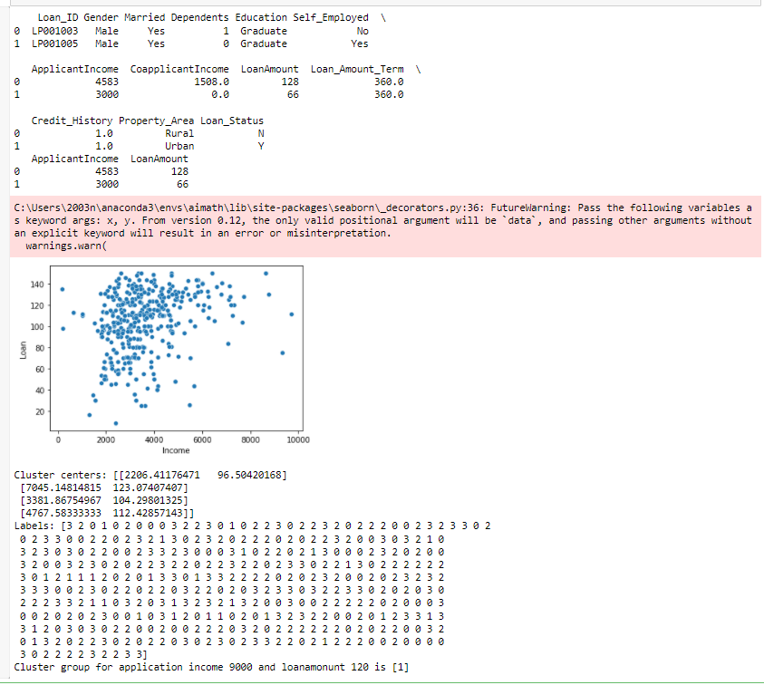

# Implementation of K-Means Clustering Algorithm
## Aim
To write a python program to implement K-Means Clustering Algorithm.
## Equipment’s required:
1.	Hardware – PCs
2.	Anaconda – Python 3.7 Installation

## Algorithm:

Step1:
Import the necessary modules & packages using import statement.

Step2:
Read the given csv file using read_csv() method and print the number of contents to be displayed using df.head() from pandas module.

Step3:
Plot a graph for the applicant income vs loan amount lot using sns.scatterplot from seaaborn module.

Step4:
Obtain the kmeam clustering, display the clusters using .cluster_centers_ and the labels using .labels_.

Step5:
Predict the k means using kmean.predict() method by with parameter 9000(income) and 1200(loanamount).

Step6:
Print the k means.

Step7:
End of the Program.

## Program:
```
#Python program to implement K-Means Clustering Algorithm
#Developed By: Pavankishore.M
#Register Number: 212221230076

import pandas as pd
from sklearn.cluster import KMeans 
import matplotlib.pyplot as plt
import seaborn as sns 
x1 = pd.read_csv('clustering.csv') 
print (x1.head (2)) 
x2 = x1.loc[:,['ApplicantIncome', 'LoanAmount']] 
print(x2.head (2))

x=x2.values
#print(x)
sns.scatterplot (x[:,0],x[:,1])
plt.xlabel('Income')
plt.ylabel('Loan')
plt.show()

kmeans=KMeans(n_clusters=4)
kmeans.fit(x)
print("Cluster centers:", kmeans.cluster_centers_)
print("Labels:", kmeans.labels_)
predict_class = kmeans.predict([[9000, 1200]])
print("Cluster group for application income 9000 and loanamonunt 120 is",predict_class)

```
## Output:


## Result
Thus the K-means clustering algorithm is implemented and predicted the cluster class using python program.